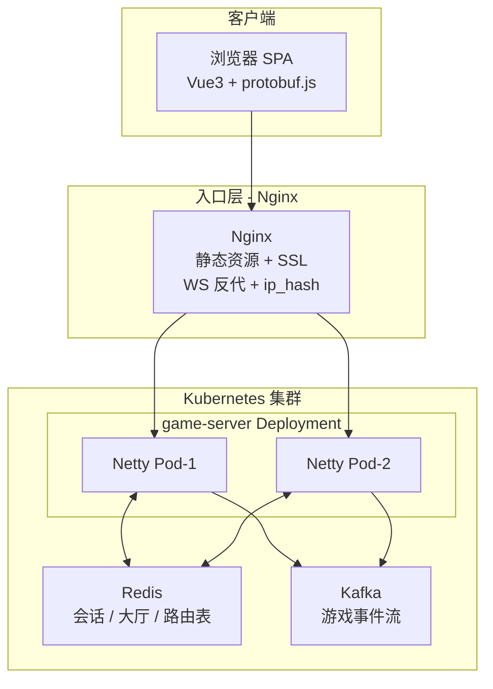

# Poker_AA 完整规划

> 目标产品：进入网页 → 创建房间 → 选择游戏（德州扑克，未来可扩展）→ 联机对战。  
> 本文档描述目标架构、技术栈、分阶段路线与当前进度。  
> 协作约定见 [开发约定.md](./开发约定.md)。

---

## 一、目标产品 vs 当前现状

| 目标功能 | 当前状态 |
|---------|---------|
| 进入网页 | **Vue3 SPA**（`frontend/`）+ `test.html` 联调页 |
| 联机打牌 | **已完成** — 双窗口坐下自动开局，可操作并收到快照 |
| 创建房间 | **已完成** — `CREATE_ROOM` + 大厅 UI |
| 选择德州扑克 | **已完成** — `GameType.TEXAS_HOLDEM` |
| 未来多游戏 | **未设计** — 需 `GameEngine` 抽象（阶段 3） |
| Nginx / Redis / Kafka / K8s | **均未接入**（阶段 3+） |

**整体完成度约 55%**（阶段 2 已完成，阶段 3 尚未开始）。

---

## 二、目标生产架构



### 组件职责边界

| 组件 | 负责 | 不负责 |
|------|------|--------|
| Netty 游戏服 | 实时 WebSocket、牌局状态机、房间内广播 | 静态页、持久化分析 |
| Nginx | 静态 SPA、WS 反代、SSL、负载均衡 | 解析 Protobuf、游戏逻辑 |
| Redis | Session、大厅列表、房间→Pod 路由 | **实时牌桌状态** |
| Kafka | 异步事件（建房、手牌结束、审计） | **实时同步**（走 WS） |
| K8s | 编排、扩缩容、配置、Ingress | 业务逻辑 |

**设计原则：** 牌桌状态在 Netty Pod 内存；Redis 管「找房间、Session」；Kafka 管「事后可追溯事件」。

---

## 三、技术栈

### 3.1 应用层

| 层 | 技术 | 状态 |
|----|------|------|
| 游戏后端 | Java 17 + Maven + Netty 4.1 + Protobuf 3.25 | 已运行 |
| 联调前端 | HTML + JS + protobuf.js（`test.html`） | 已完成 |
| 正式前端 | Vue 3 + Vite + TypeScript + protobufjs | **已运行** |
| 协议 | `src/main/proto/game_protocol.proto` | 阶段 2 字段已齐 |

### 3.2 基础设施（规划）

| 组件 | 用途 |
|------|------|
| Nginx 1.25+ | 静态 SPA、`/ws` 反代、`ip_hash`、HTTPS |
| Redis 7.x + Lettuce | Session、大厅、房间路由、Pub/Sub |
| Kafka 3.x | 生命周期事件、手牌结束、审计 |
| K8s 1.28+ | Deployment、Ingress、HPA、ConfigMap |
| Docker + docker-compose | 本地全栈；Helm 用于生产 |

---

## 四、Redis 设计（阶段 3）

| Key | 类型 | 内容 |
|-----|------|------|
| `session:{token}` | Hash | userId, roomId, seatIndex, podId |
| `lobby:rooms` | Sorted Set | 大厅房间列表 |
| `room:{roomId}:meta` | Hash | gameType, blinds, **podId** |
| `pod:{podId}:rooms` | Set | Pod 持有的 roomId |

跨 Pod：Nginx `ip_hash`（初期）或 Redis 存 `roomId → podId` + 客户端重连（成熟期）。

---

## 五、Kafka 设计（阶段 4）

| Topic | 内容 |
|-------|------|
| `room.lifecycle` | 创建、解散、进出 |
| `game.hand.finished` | 每手牌结果 |
| `player.action` | 操作审计（可选采样） |

投递时机：`settleHand()` 后、`createRoom()` 后；**不阻塞**牌局主线程。

---

## 六、Nginx 设计（阶段 4）

- `/` → Vue SPA 静态资源，`try_files` 支持前端路由
- `/ws` → `upstream game_ws` + `ip_hash` + WebSocket 升级头
- 读超时 3600s，支持长连接

---

## 七、Kubernetes 设计（阶段 5）

| 资源 | 说明 |
|------|------|
| Deployment `game-server` | Netty，replicas 2+，HPA |
| Deployment `nginx` 或 Ingress | 入口 |
| StatefulSet / 云服务 | Redis、Kafka |
| ConfigMap / Secret | 连接串、盲注默认值 |

扩缩容：新 Pod 只接新房间；缩容前 draining，等房间清空。

---

## 八、分阶段路线图

### 阶段 1：最小可玩闭环 — **已完成**

| 任务 | 状态 |
|------|------|
| 修复引擎 bug（`addChips`、下注轮、盲注等） | 完成 |
| `RoomRouter` 接通 `GameManager` | 完成 |
| `SessionManager` / `PlayerSession` | 完成 |
| `SnapshotBroadcaster` 广播快照 | 完成 |
| `test.html` protobuf 编解码 + 完整操作 | 完成 |

**验收：** 双窗口 666 房间，两人坐下自动开局，可操作并收到快照。

---

### 阶段 2：产品 UI + 大厅 + 动态建房间 — **已完成**

**目标：** 进入网页 → 大厅 → 创建房间 → 选德州扑克 → 进桌。

| 任务 | 状态 |
|------|------|
| 扩展 proto | 完成 |
| 大厅逻辑 | 完成（含空房 5 分钟超时销毁） |
| 新建 `frontend/` | 完成（大厅 + 牌桌） |
| Vite 代理 | 完成 |

**验收：** Vue 前端连接 → 创建房间 → 第二人进入 → 两人坐下 → 自动开局 → 游戏动作与快照正常。

---

### 阶段 3：多游戏抽象 + Redis — **基本完成**

| 任务 | 状态 |
|------|------|
| `GameEngine` 接口 + 工厂 | 完成 |
| `RedisRoomRegistry` | 完成 |
| `RedisSessionStore` + Session 持久化 | 完成 |
| `PodIdentity` | 完成 |
| docker-compose 加 Redis | 完成 |
| proto `RECONNECT` + 断线重连 | 完成 |
| 跨 Pod 进房提示 | 未做（阶段 4 多实例时处理） |

**验收：** 进桌坐下 → 刷新页面或断线 → 自动 `RECONNECT` → 回到原房间/座位，快照与 `isOnline` 正常。

---

### 阶段 4：Nginx + Kafka + Docker Compose — **已完成**

| 任务 | 状态 |
|------|------|
| 游戏服 `Dockerfile` + Maven shade 打包 | 完成 |
| Nginx 托管前端 + `/ws` 反代 + `ip_hash` | 完成 |
| `EventPublisher`（Kafka Producer） | 完成 |
| docker-compose 全栈 | 完成 |
| 跨 Pod 进房 `ErrorResponse` 提示 | 完成 |

详见 [deploy/README.md](../deploy/README.md)。

**验收：** `docker compose up --build` → 访问 8080 → 创建房间、对战；Kafka 能消费 `poker.events`。

---

### 阶段 5：Kubernetes 部署 — **已完成**

| 任务 | 状态 |
|------|------|
| 镜像构建脚本 | 完成 |
| K8s manifests + Kustomize | 完成 |
| Ingress + TLS 可选配置 | 完成 |
| HPA（game-server 2–4 副本） | 完成 |
| 优雅下线（preStop + SIGTERM draining） | 完成 |

详见 [deploy/k8s/README.md](../deploy/k8s/README.md)。

**验收：** `kubectl apply -k deploy/k8s` → NodePort 30080 或 Ingress 访问 → 对战正常；滚动更新时 Pod 优雅退出。

---

### 阶段 6：工程质量与运维

- 单元测试（`HandEvaluator`、下注轮、Redis）
- 集成测试（Testcontainers + WebSocket 客户端）
- SLF4J + Logback、Prometheus、CI/CD、README

---

## 九、目标目录结构

```
Poker_AA/
├── docs/                    # 文档（本目录）
├── deploy/                  # 阶段 4+ 创建
│   ├── docker/
│   ├── nginx/
│   ├── docker-compose.yml
│   └── k8s/
├── frontend/                # 阶段 2 创建
├── src/main/
│   ├── java/com/mercury/poker/
│   │   ├── engine/          # 游戏引擎
│   │   └── network/         # 网络网关
│   └── proto/
├── test.html
└── pom.xml
```

---

## 十、完成度估算

| 模块 | 当前 | 阶段 2 后 | 阶段 6 后 |
|------|------|-----------|-----------|
| 德州扑克引擎 | ~85% | ~90% | ~95% |
| WebSocket 网关 | ~85% | ~90% | ~95% |
| 联调前端 | ~80% | — | — |
| 正式 SPA | 0% | ~70% | ~90% |
| Redis / Kafka / Nginx / K8s | 0% | 0% | ~85% |
| **整体产品** | **~35%** | **~55%** | **~90%** |

| 阶段 | 预估工时（1 人） |
|------|------------------|
| 阶段 2 前端 + 大厅 | 2–3 周 |
| 阶段 3 Redis + 抽象 | 1–2 周 |
| 阶段 4 Nginx + Kafka | 1–2 周 |
| 阶段 5 K8s | 1–2 周 |
| 阶段 6 测试 + CI/CD | 1–2 周 |

---

## 十一、风险与注意事项

1. **多 Pod 必须粘性会话或重连路由**，否则房间状态丢失。
2. **Kafka 不能替代 WebSocket** 做实时牌局同步。
3. **Redis 不存牌桌实时状态**，只存元数据与 Session。
4. 生产环境 Redis/Kafka 优先用云服务，K8s 自建仅用于学习。

---

## 十二、下一步

**阶段 6：** 单元/集成测试、Logback、Prometheus、CI/CD、README。

类与调用关系详见 [类说明与关系.md](./类说明与关系.md)。

---

*最后更新：阶段 5 完成（K8s manifests + Ingress + HPA + 优雅下线）*
