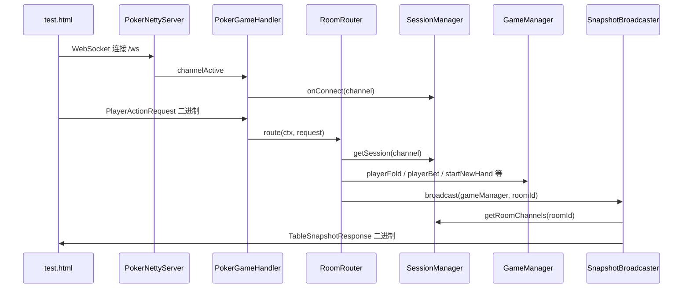
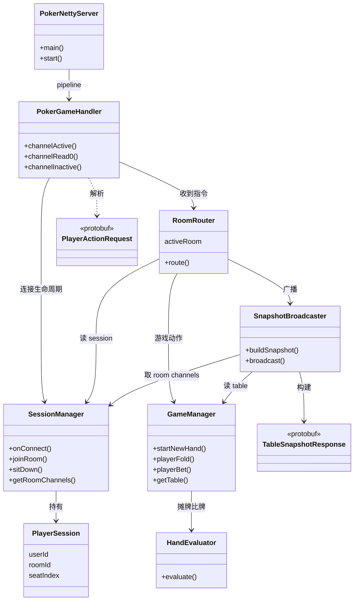

# Poker_AA 类说明与关系

> 本文档解释 **`engine.model` 包以外** 各类的职责，以及它们如何协作。  
> `model` 包（`Card`、`Player`、`Table` 等）为纯数据与规则对象，此处不展开。  
> 协议生成类位于 `com.mercury.poker.network.protocol`，由 `game_protocol.proto` 自动生成。

---

## 一、整体分层

```
┌─────────────────────────────────────────────────────────┐
│  test.html（浏览器）                                      │
│  WebSocket + Protobuf 二进制帧                            │
└───────────────────────────┬─────────────────────────────┘
                            │
┌───────────────────────────▼─────────────────────────────┐
│  network 包 — 网络网关层                                  │
│  PokerNettyServer → PokerGameHandler → RoomRouter         │
│       SessionManager / PlayerSession                      │
│       SnapshotBroadcaster                                 │
└───────────────────────────┬─────────────────────────────┘
                            │
┌───────────────────────────▼─────────────────────────────┐
│  engine 包 — 游戏逻辑层（不含 model）                      │
│  GameManager ←→ HandEvaluator                              │
└───────────────────────────┬─────────────────────────────┘
                            │
┌───────────────────────────▼─────────────────────────────┐
│  engine.model 包 — 牌、玩家、牌桌（本文档不详解）           │
└─────────────────────────────────────────────────────────┘
```

**一句话：** 浏览器发 `PlayerActionRequest` → 网关解析 → 路由器分发 → 引擎改状态 → 广播器发 `TableSnapshotResponse` 回浏览器。

---

## 二、请求处理全流程



---

## 三、network 包

### 3.1 PokerNettyServer

| 项目 | 说明 |
|------|------|
| **路径** | `com.mercury.poker.network.PokerNettyServer` |
| **角色** | 程序**入口**，启动 Netty 服务器 |
| **职责** | 监听端口 8888；组装 Pipeline（HTTP → WebSocket → 业务 Handler）；启动时初始化 `RoomRouter` |
| **不负责** | 解析业务、游戏逻辑 |

**Pipeline 顺序（每个新连接）：**

1. `HttpServerCodec` — HTTP 编解码  
2. `ChunkedWriteHandler` — 大块传输  
3. `HttpObjectAggregator` — 合并 HTTP 分片  
4. `WebSocketServerProtocolHandler("/ws")` — 握手、升级 WebSocket  
5. `PokerGameHandler` — 你的业务代码  

**启动方式：** 运行 `PokerNettyServer.main()`。

---

### 3.2 PokerGameHandler

| 项目 | 说明 |
|------|------|
| **路径** | `com.mercury.poker.network.PokerGameHandler` |
| **角色** | WebSocket **业务入口**（Netty Handler） |
| **职责** | 连接建立/断开时通知 `SessionManager`；收到二进制帧时反序列化为 `PlayerActionRequest`，转交 `RoomRouter` |
| **不负责** | 房间逻辑、游戏规则、广播内容构建 |

**关键方法：**

| 方法 | 触发时机 | 做什么 |
|------|----------|--------|
| `channelActive` | 客户端连上 | `SessionManager.onConnect` |
| `channelInactive` | 客户端断开 | `SessionManager.onDisconnect` |
| `channelRead0` | 收到 WS 二进制消息 | `parseFrom` → `RoomRouter.route` |
| `exceptionCaught` | 异常 | 打日志并关闭连接 |

---

### 3.3 SessionManager

| 项目 | 说明 |
|------|------|
| **路径** | `com.mercury.poker.network.SessionManager` |
| **角色** | **会话管理器**（单例 `getINSTANCE()`） |
| **职责** | 维护「谁连上了、在哪个房间、坐哪一号位」；提供按房间查所有连接，供广播使用 |
| **不负责** | 游戏规则、Protobuf 编解码 |

**内部两张表：**

| 结构 | 含义 |
|------|------|
| `sessions`：`ChannelId → PlayerSession` | 每条 WebSocket 对应一个玩家会话 |
| `roomChannels`：`roomId → Set<Channel>` | 每个房间里有哪些连接（用于群发快照） |

**关键方法：**

| 方法 | 作用 |
|------|------|
| `onConnect` | 用 channelId 生成临时 userId / username，创建 `PlayerSession` |
| `onDisconnect` | 移除 session，并从房间 channel 集合中删掉 |
| `joinRoom` | 设置 `roomId`，把 channel 加入 `roomChannels` |
| `sitDown` | 设置 `seatIndex` |
| `getSession` | 根据 channel 取会话 |
| `getRoomChannels` | 取某房间全部连接（广播用） |

---

### 3.4 PlayerSession

| 项目 | 说明 |
|------|------|
| **路径** | `com.mercury.poker.network.PlayerSession` |
| **角色** | **网络层玩家会话**（纯数据类） |
| **职责** | 存一条连接上的玩家身份与状态：`userId`、`username`、`roomId`、`seatIndex` |
| **与 model.Player 区别** | `PlayerSession` = 「这条 WS 是谁」；`model.Player` = 「牌桌上筹码、底牌、下注」 |

**为何需要两个 Player？**

- 连接层：还没坐下时只有 Session，没有 `model.Player`  
- 坐下后：`RoomRouter` 用 Session 的信息创建 `model.Player` 并 `table.sitDown`  
- 游戏动作以 **`session.getSeatIndex()`** 为准，防止客户端伪造座位  

---

### 3.5 RoomRouter

| 项目 | 说明 |
|------|------|
| **路径** | `com.mercury.poker.network.RoomRouter` |
| **角色** | **房间路由器 / 业务编排**（单例 `getInstance()`） |
| **职责** | 管理所有 `GameManager`（内存房间表）；把 `ActionType` 翻译成引擎调用；每次动作后触发广播 |
| **不负责** | 底层 WS 读写、Protobuf 字段拼装细节 |

**内存结构：**

```java
ConcurrentHashMap<String, GameManager> activeRoom
// 例如 "666" → 一个 6 人桌 GameManager（盲注 10/20）
```

**`route` 方法：** 根据 `request.getActionType()` 分发：

| ActionType | 处理方法 | 引擎/副作用 |
|------------|----------|-------------|
| JOIN_ROOM | `handleJoinRoom` | `sessionManager.joinRoom` + 广播 |
| SIT_DOWN | `handleSitDown` | 创建 `model.Player`、`table.sitDown`；≥2 人则 `startNewHand` |
| FOLD | `handleFold` | `gameManager.playerFold` |
| CHECK | `handleCheck` | `gameManager.playerBet(seat, currentBet)` |
| CALL | `handleCall` | `gameManager.playerBet(seat, currentMaxBet)` |
| RAISE | `handleRaise` | `gameManager.playerBet(seat, targetTotalBet)` |

**辅助方法：**

| 方法 | 作用 |
|------|------|
| `requireJoined` / `requireSeated` | 校验是否已加入房间 / 已坐下 |
| `countSeatedPlayers` | 统计座位上有人的数量 |
| `isHandInProgress` | 是否已有底牌（防止重复开局） |
| `broadcastSnapshot` | 委托给 `SnapshotBroadcaster` |

---

### 3.6 SnapshotBroadcaster

| 项目 | 说明 |
|------|------|
| **路径** | `com.mercury.poker.network.SnapshotBroadcaster` |
| **角色** | **牌桌快照构建与广播**（单例 `getINSTANCE()`） |
| **职责** | 把 `GameManager` 内的 `Table` 转成 `TableSnapshotResponse`；对房间内每个连接各发一帧（底牌按 viewer 过滤） |
| **不负责** | 修改游戏状态、路由指令 |

**两个核心方法：**

| 方法 | 作用 |
|------|------|
| `buildSnapshot(gameManager, roomId, viewerUserId)` | 读 Table + Player，组装 Protobuf；仅当 `player.userId == viewerUserId` 时填充 `hole_cards` |
| `broadcast(gameManager, roomId)` | 遍历 `getRoomChannels`，每人 build 一次， `writeAndFlush(BinaryWebSocketFrame)` |

**为何每人 build 一次？** 防作弊：A 不能看到 B 的底牌，必须按观看者分别构建消息。

---

## 四、engine 包（非 model）

### 4.1 GameManager

| 项目 | 说明 |
|------|------|
| **路径** | `com.mercury.poker.engine.GameManager` |
| **角色** | **德州扑克一局的状态机 / 裁判** |
| **职责** | 开局、盲注、发牌、处理 fold/bet、推进 Flop/Turn/River、摊牌分池 |
| **持有** | 一个 `Table`、一个 `HandEvaluator`、小盲/大盲金额 |
| **不负责** | 网络、Session、Protobuf |

**对外主要 API（被 RoomRouter 调用）：**

| 方法 | 作用 |
|------|------|
| `getTable()` | 供 `SnapshotBroadcaster` 读取牌桌状态 |
| `startNewHand()` | 新一局：移庄家、下盲、发底牌、定首动 |
| `playerFold(seatIndex)` | 弃牌并检查是否进入下一街或收池 |
| `playerBet(seatIndex, targetTotalBet)` | 过牌 / 跟注 / 加注（参数为本轮目标总下注额） |
| `settleHand()` | 摊牌比牌或单人收池（内部用 `HandEvaluator`） |

**内部协作：** 大量 private 方法（`postBlinds`、`checkRoundOrHandOver`、`advanceStreet` 等）在内部推进流程，外部只需调用 fold/bet/start。

---

### 4.2 HandEvaluator

| 项目 | 说明 |
|------|------|
| **路径** | `com.mercury.poker.engine.HandEvaluator` |
| **角色** | **牌型计算器**（工具类，无状态） |
| **职责** | 7 张牌选最优 5 张，判定牌型（高牌 → 同花顺），返回可比较的 `HandValue` |
| **调用者** | 仅 `GameManager.settleHand()` 在摊牌时使用 |
| **不负责** | 下注、轮转、网络 |

**核心方法：** `evaluate(List<Card> sevenCards)` → `HandValue`

---

## 五、protocol 包（Protobuf 生成，勿手改）

| 类 | 方向 | 含义 |
|----|------|------|
| `PlayerActionRequest` | 客户端 → 服务端 | 操作类型、roomId、seatIndex、amount |
| `TableSnapshotResponse` | 服务端 → 客户端 | 底池、公牌、各座位状态、轮到谁 |
| `PlayerState` | 快照内嵌 | 单个座位的 chips、bet、fold、hole_cards 等 |
| `ActionType` | 枚举 | JOIN_ROOM、SIT_DOWN、FOLD、CHECK、CALL、RAISE |

定义源文件：`src/main/proto/game_protocol.proto`  
修改 proto 后需 `mvn compile` 重新生成 Java 类。

---

## 六、其他文件

| 文件 | 说明 |
|------|------|
| `org.example.Main` | Maven 模板占位，**与项目无关**，可忽略 |
| `test.html` | 浏览器联调页：连接 WS、编码 `PlayerActionRequest`、解码 `TableSnapshotResponse` |

---

## 七、类关系总图



---

## 八、单例与入口速查

| 类 | 获取方式 | 生命周期 |
|----|----------|----------|
| `PokerNettyServer` | `new` + `main` | 进程级 |
| `RoomRouter` | `getInstance()` | JVM 级单例 |
| `SessionManager` | `getINSTANCE()` | JVM 级单例 |
| `SnapshotBroadcaster` | `getINSTANCE()` | JVM 级单例 |
| `GameManager` | `RoomRouter.activeRoom.get(roomId)` | 每房间一个 |
| `HandEvaluator` | `GameManager` 内部 `new` | 每 GameManager 一个 |

---

## 九、常见问题

**Q：`RoomRouter` 和 `GameManager` 有什么区别？**  
A：`RoomRouter` 管「有哪些房间、网络指令怎么分发」；`GameManager` 管「某一个房间里牌怎么打」。

**Q：为什么 Session 不放在 GameManager 里？**  
A：Session 绑定的是 **WebSocket 连接**；GameManager 只应关心 **牌桌规则**。分层后，以后换 Redis 存 Session 或加多 Pod 时，引擎层不用改。

**Q：快照为什么不在 RoomRouter 里直接写？**  
A：构建 Protobuf、按 viewer 隐藏底牌、遍历 channel 发送，逻辑独立且会变复杂，单独 `SnapshotBroadcaster` 更清晰。

**Q：HandEvaluator 为什么不在 network 包？**  
A：它是纯规则算法，不依赖 Netty；属于引擎能力，便于单元测试。

---

*相关文档：[完整规划.md](./完整规划.md) · [开发约定.md](./开发约定.md)*
